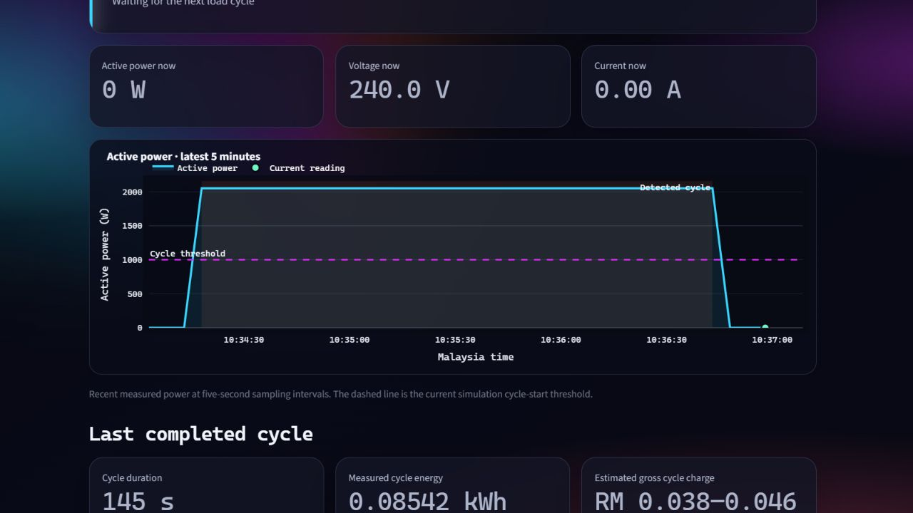
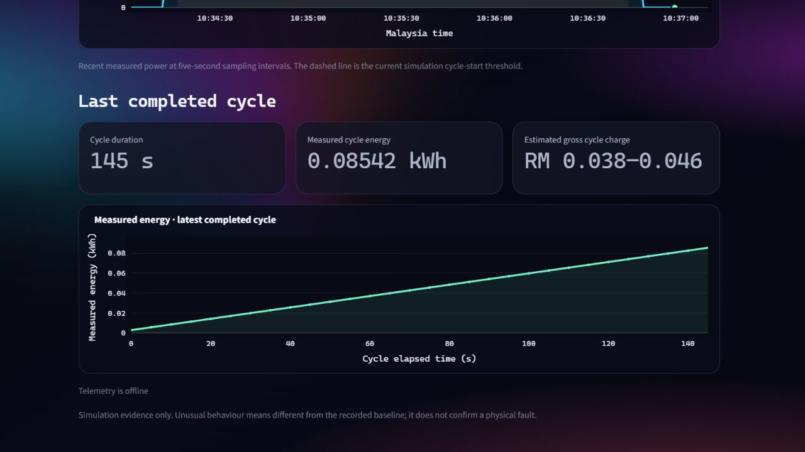
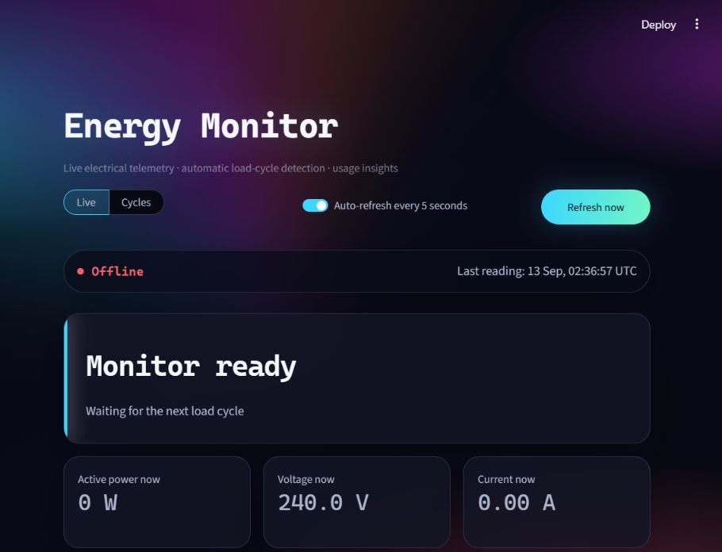
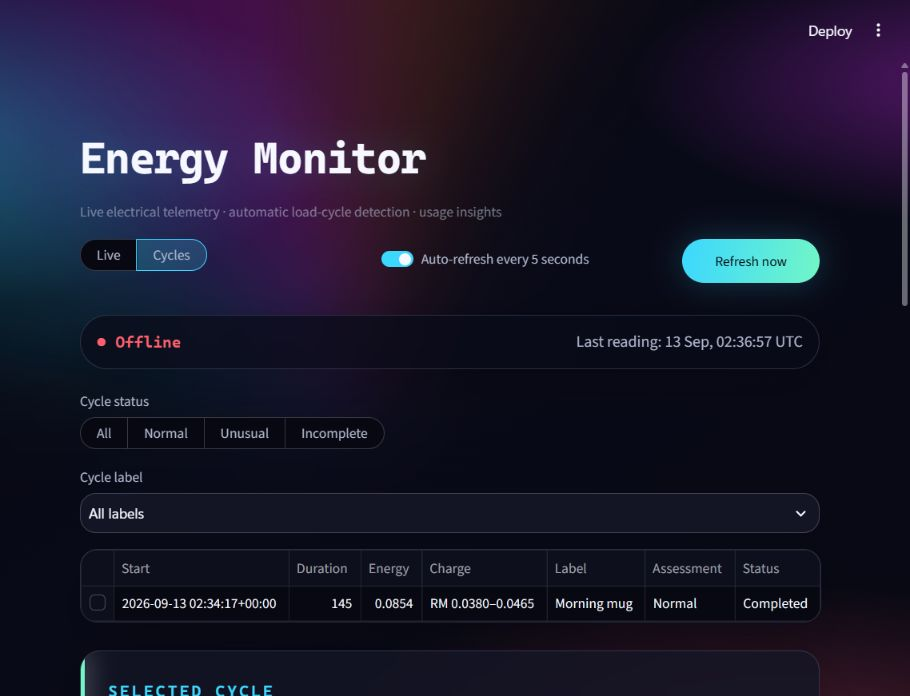

# Energy Monitor dashboard review

## Audit scope

- Surface: local Streamlit Energy Monitor dashboard.
- Flow: Live monitoring, cycle history, and reusable cycle labels.
- Evidence: current simulated dataset at a 910 x 698 browser viewport.
- Goal: identify the next dashboard improvements before the Git documentation/PR step.

## Overall verdict

The dashboard has a clear identity, readable operating state, and a useful separation between live readings and completed cycles. Its main weakness is that the Live view reports the present value without showing its recent movement. The next development pass should add a temporal view before adding more cards or an AI reporting layer.

## Implementation update - 13 September 2026

The first visualisation batch is complete:

- A rolling five-minute active-power trace now shows measured samples without smoothing.
- The configured 1,000 W start threshold is visible, and the detected cycle interval is shaded.
- A second trace shows measured energy accumulating for the active cycle, or the latest completed cycle while idle.
- The chart units, hover details, Malaysia-time axis, and final energy point were verified against the dashboard data.
- Each graph now has an explicit `Reset view` control for restoring the original zoom and scale.
- Any cycle-history cell now selects its row, removing reliance on the small row selector.
- Cycle history now uses Malaysia time and compact values; the detailed receipt keeps UTC and exact precision.
- Manual records now use a separate form, visible source label, audit notes, and no fabricated telemetry trace or anomaly assessment.

The next recommended batch is now cycle-history selection and date/number formatting, followed by power-quality detail.

## Review steps

### 1. Live monitoring - Healthy foundation, needs a time-series view

Strengths:

- Current state, freshness, and the three primary electrical readings are easy to scan.
- Offline status uses both text and colour.
- Auto-refresh can be paused and manual refresh is visible.

Risks and opportunities:

- Power, voltage, and current are isolated numbers; the user cannot see a spike, ramp, cycle start, or dropout.
- The large state panel consumes the main visual area even when the monitor is idle.
- The last completed cycle is below the initial viewport, so an idle Live screen feels sparse.

Implemented in the first visualisation batch:

1. Added one wide rolling **Active power over time** chart as the primary Live visual.
2. Added the cycle-start threshold and detected-cycle shading.
3. Added a smaller **Cycle energy accumulation** chart for the active cycle or most recent completed cycle.
4. Compact voltage and current sparklines remain a later enhancement rather than three competing full-size charts.

### 2. Cycle history - Functional, but selection and formatting need refinement

Strengths:

- Status and user-label filters are easy to understand.
- The cycle receipt distinguishes measured energy from an estimated charge.
- User-defined labels now make the workflow suitable for multiple appliances and test conditions.

Risks and opportunities:

- The row-selection target is small and not visually obvious.
- The timestamp uses a raw timezone string in the table while the receipt uses a friendlier format.
- Charge and energy values expose more decimal detail than is needed for fast scanning.

Implemented in the cycle-history usability batch:

1. Made every cell a row-selection target and added clear selection guidance.
2. Formatted history time as local Malaysia time while retaining UTC in the detail/audit record.
3. Used concise table values while keeping exact precision in the receipt and tariff disclosure.

### 3. Reusable cycle labels - Healthy first version

Strengths:

- Labels are created once and reused across cycles.
- Relabelling preserves assignment history.
- The same mechanism can represent volume, appliance, operating mode, or test condition.

Implemented in the label-management batch:

1. Added audit-safe label removal from future choices.
2. Preserved past cycle assignments and label history.
3. Re-adding the same label restores it for future use.

Recommended later additions:

1. Add rename controls after real usage confirms they are needed.
2. Require enough examples per label before a future classifier claims it can recognise that label.
3. Keep AI-generated reports downstream of verified measurements and completed cycles.

## Accessibility and runtime notes

- No browser console errors or warnings were observed.
- No horizontal overflow was present at the captured viewport.
- Controls had accessible names in the browser accessibility tree.
- The small grey captions may need contrast measurement against the gradient background.
- Keyboard order, screen-reader announcements during auto-refresh, and 320 px phone reflow still require a dedicated verification pass; screenshots alone cannot prove full WCAG compliance.

## Development priority

1. Live active-power time series and cycle-state annotations.
2. Conditional cycle-energy accumulation chart.
3. Better cycle-table selection and date/number formatting.
4. Power-quality details such as frequency and power factor. Completed.
5. Label management refinements. Removal completed; rename remains optional.
6. Final font replacement.
7. Agentic reporting module after the measurement views are stable.
